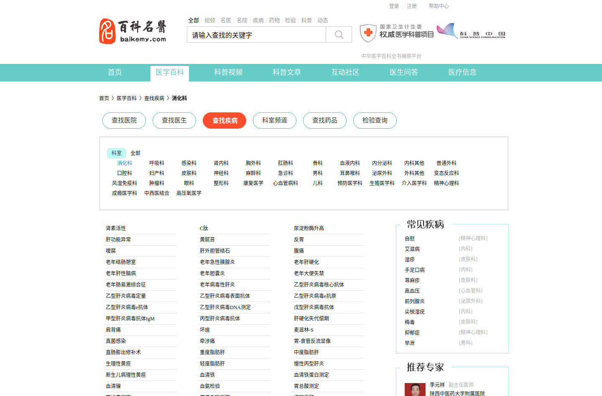
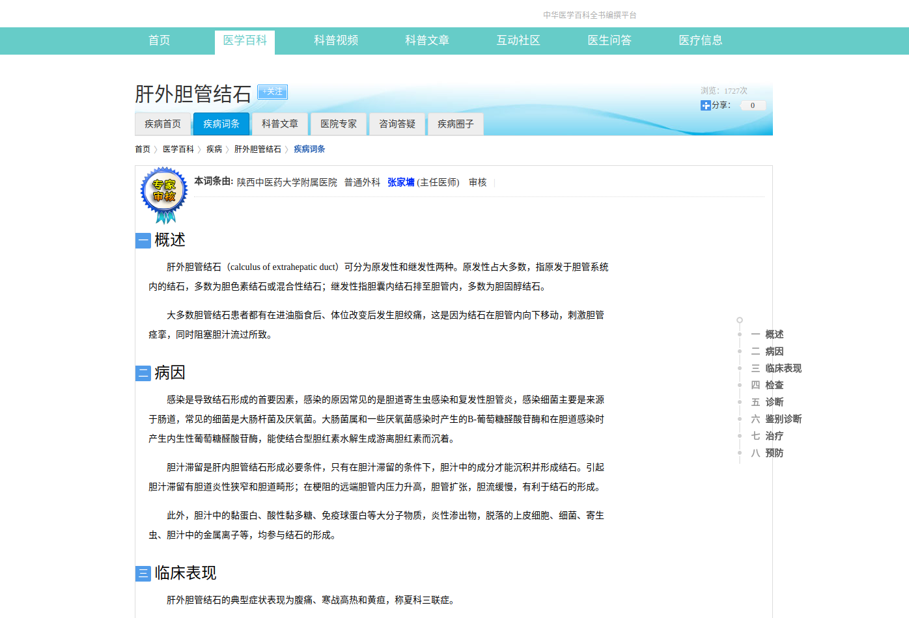

# 数据下载
涉及到该网站的版权问题，不提供下载，这里仅提供技术。想继续探讨的可以邮件联系。

# 数据展示

### 所有科室
```
消化科	http://www.baikemy.com/disease/list/1/34
呼吸科	http://www.baikemy.com/disease/list/1/33
感染科	http://www.baikemy.com/disease/list/1/12
肾内科	http://www.baikemy.com/disease/list/1/40
胸外科	http://www.baikemy.com/disease/list/2/49
肛肠科	http://www.baikemy.com/disease/list/2/119
骨科	http://www.baikemy.com/disease/list/2/73
血液内科	http://www.baikemy.com/disease/list/1/44
内分泌科	http://www.baikemy.com/disease/list/1/36
内科其他	http://www.baikemy.com/disease/list/1/145
普通外科	http://www.baikemy.com/disease/list/2/86
口腔科	http://www.baikemy.com/disease/list/7/0
妇产科	http://www.baikemy.com/disease/list/3/0
皮肤科	http://www.baikemy.com/disease/list/9/0
神经科	http://www.baikemy.com/disease/list/69/0
麻醉科	http://www.baikemy.com/disease/list/19/0
急诊科	http://www.baikemy.com/disease/list/62/0
男科	http://www.baikemy.com/disease/list/74/0
耳鼻喉科	http://www.baikemy.com/disease/list/6/0
泌尿外科	http://www.baikemy.com/disease/list/2/50
外科其他	http://www.baikemy.com/disease/list/2/144
变态反应科	http://www.baikemy.com/disease/list/1/72
风湿免疫科	http://www.baikemy.com/disease/list/1/39
肿瘤科	http://www.baikemy.com/disease/list/13/0
眼科	http://www.baikemy.com/disease/list/8/0
整形科	http://www.baikemy.com/disease/list/79/0
康复医学	http://www.baikemy.com/disease/list/15/0
心血管病科	http://www.baikemy.com/disease/list/81/0
儿科	http://www.baikemy.com/disease/list/5/0
预防医学科	http://www.baikemy.com/disease/list/21/0
生殖医学科	http://www.baikemy.com/disease/list/4/0
介入医学科	http://www.baikemy.com/disease/list/22/0
精神心理科	http://www.baikemy.com/disease/list/23/0
成瘾医学科	http://www.baikemy.com/disease/list/76/0
中西医结合科	http://www.baikemy.com/disease/list/27/0
高压氧医学科	http://www.baikemy.com/disease/list/24/0

```

### 部分疾病目录展示
```
继发性痛经	http://www.baikemy.com/disease/view/2109	妇产科
老年性外阴萎缩	http://www.baikemy.com/disease/view/2110	妇产科
老年性阴道炎	http://www.baikemy.com/disease/view/2111	妇产科
间质性膀胱炎、局限性外阴炎和脱屑性阴道炎综合征	http://www.baikemy.com/disease/view/2112	妇产科
霉菌性外阴炎	http://www.baikemy.com/disease/view/2113	妇产科
霉菌性阴道炎	http://www.baikemy.com/disease/view/2114	妇产科
麦格斯综合征	http://www.baikemy.com/disease/view/2115	妇产科
非肾上腺素增生性假两性畸形	http://www.baikemy.com/disease/view/2411	妇产科
药物流产	http://www.baikemy.com/disease/view/2174	妇产科
卵巢癌	http://www.baikemy.com/disease/view/1559	妇产科
不孕症	http://www.baikemy.com/disease/view/1057	妇产科
畸胎瘤	http://www.baikemy.com/disease/view/1569	妇产科
外阴溃疡	http://www.baikemy.com/disease/view/1060	妇产科
外阴炎	http://www.baikemy.com/disease/view/1061	妇产科
子宫息肉	http://www.baikemy.com/disease/view/1065	妇产科
妇科疾病	http://www.baikemy.com/disease/view/1845	妇产科
输卵管炎	http://www.baikemy.com/disease/view/1081	妇产科
```

### 部分疾病详情展示

```json
[
  {
    "name": "肾素活性",
    "keshi": "消化科",
    "id": "35509911352065",
    "type": "检查",
    "url": "http://www.baikemy.com/disease/detail/35509911352065/1",
    "info": [
      {
        "para": "肾素由肾小球旁细胞产生、贮存、分泌，是一种水解蛋白酶，能作用血管紧张素原转变为血管紧张素Ⅰ，再通过转化酶的作用形成血管紧张素Ⅱ。肾素-血管紧张素系统在机体血压、水和电解质平衡的调节中起重要作用。检测人体血浆中肾素含量以肾素活性（PRA）方式表达，血浆PRA的测定，实际是测定血浆中血管紧张素Ⅰ的产生速率。检测血浆中PRA浓度已成为肾性高血压、内分泌型高血压的诊断所必需，也是高肾素低血容量型高血压、低肾素高血容量型高血压、正常肾素正常血容量型高血压分类的依据。如肾性高血压和原发性醛固酮增多症的鉴别诊断。前者基础值增高，对立位、低钠和速尿的激发反应正常，后者基础值常低下，特别是激发反应低下。慢性肾功衰伴高血压时，测定血浆肾素活性有助于区分可治性（血容量高，肾素活性不高）和顽固性（肾素活性增高）高血压，前者透析疗法有效，后者则透析效果不佳，切除肾脏才可望血压下降。\n",
        "index": "一",
        "title": "概述"
      },
      {
        "para": "肾素是调节水盐代谢及血压的激素，对心血管、肾病、内分泌疾病的诊断和治疗有重要意义。\n1.降低：见于原发性高血压低肾素型、原发性醛固酮增多症、假性醛固酮增多症、糖皮质素抑制性醛固酮增多症、11-β羟化酶缺乏症、肾上腺素瘤、17-α羟化酶缺乏症、分泌促肾上腺激素异位瘤、肾实质性疾病等。\n2.升高：见于原发性高血压高肾素型、恶性高血压、巴特综合征、血管性高血压、妊娠、肝硬化水肿、肾上腺功能减退、低钠饮食、肾小球旁细胞瘤等。\n",
        "index": "二",
        "title": "临床意义"
      },
      {
        "para": "卧位：0.42±0.37ng/dl；立位：2.97±1.02ng/dl\n",
        "index": "三",
        "title": "正常值参考范围"
      }
    ]
  },
  {
    "name": "C肽",
    "keshi": "消化科",
    "id": "35508567891457",
    "type": "检查",
    "url": "http://www.baikemy.com/disease/detail/35508567891457/1",
    "info": [
      {
        "para": "C肽（C-Peptide）又称连接肽，由胰岛β细胞分泌，它与胰岛素有一个共同的前体胰岛素原。胰岛素原裂解成1个分子的胰岛素和1个分子的C肽，因此C肽与自身胰岛素摩尔量是一致的。因为C肽不容易被肝脏降解，因此测C肽就是测了胰岛素的含量，能准确反映胰岛细胞的功能。在口服葡萄糖耐量试验的同时可抽血测定空腹血糖负荷后1小时、2小时、3小时的血清C肽水平，正常人在服糖60分钟后C肽水平升高至基础水平的3倍以上。1型糖尿病C水平极低，胰岛功能减退者餐后C肽上升的幅度常低于3倍。对于接受胰岛素治疗的患者，用测定血中胰岛素水平不能评价自身胰岛功能，可以测定C肽水平来评价自身胰岛β细胞功能。\n",
        "index": "一",
        "title": "概述"
      },
      {
        "para": "C肽可反映机体胰岛β细胞的分泌功能，对糖尿病患者的分型和低血糖症的鉴别有指导意义。\n1.糖尿病\nC肽水平测定可应用于糖尿病分型及了解糖尿病患者胰岛β细胞的功能。无论1型或2型糖尿病患者，初病时都应通过检测C肽或胰岛素水平以判断胰岛β细胞功能。\n2.低血糖\n怀疑患有胰岛素瘤的病人发生低血糖时，测定血糖与胰岛素比值有助于诊断。而用外源性胰岛素治疗的病人发生低血糖，测定C肽可鉴别其低血糖发生的原因。\n3.胰岛移植\n了解胰岛移植是否存活除监测血糖外，还应测定C肽以了解移植后胰岛β细胞的分泌功能。\n4.肝肾疾病\n患肝炎或肝硬化时，肝脏对胰岛素摄取减少，血中胰岛素水平有升高趋势，而C肽受其影响小，血中C肽与胰岛素比值降低。发生肾病时C肽降解减慢，血中C肽水平升高，C肽与胰岛素比值明显高于正常。\n",
        "index": "二",
        "title": "临床意义"
      },
      {
        "para": "0.8～4.2ng/ml\n",
        "index": "三",
        "title": "正常值参考范围"
      }
    ]
  }
]
```


# 网站截图



